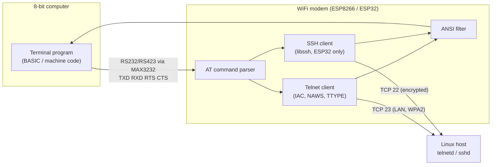

# RetroSSH

Use a **ZX Spectrum**, an **Olivetti Prodest PC128** or a **BBC Micro Model B** as a Telnet/SSH terminal to a Linux machine. An ESP8266 or ESP32 acts as a Hayes-style **WiFi modem** on the computer's serial port.



## Design decisions

- **The 8-bit computer is a dumb terminal.** A Z80 or 6502 at 1–3.5 MHz can't do Curve25519/AES fast enough for an interactive SSH session. So the **modem terminates the SSH session**, the same way a classic terminal server does. The computer only exchanges plain characters with the modem.
  - The serial cable between the computer and the modem carries plaintext. It's a short physical link on your desk. Everything on the network is protected by WPA2 (WiFi) plus SSH (end to end to the Linux host).
- **Phase 1 is Telnet on the ESP8266.** A Telnet client fits in the ESP8266's 80 KB of RAM and is enough to bring up the hardware, the serial link and the terminal programs.
- **Phase 2 is SSH on the ESP32.** The ESP8266 doesn't have enough RAM for SSH key exchange. The same firmware builds for the ESP32 with SSH enabled ([LibSSH-ESP32](https://github.com/ewpa/LibSSH-ESP32)). The AT command set is the same, plus `ATDS`.
- **Hardware flow control (RTS/CTS) is needed** at speeds above 1200 baud, and always on the Spectrum. When flow control is on, the modem sends **one byte at a time and only while CTS is asserted**. That's what the Spectrum Interface 1 needs, because its RS232 port is bit-banged and has no buffer.
- **Screen width is negotiated by the modem.** It sends Telnet NAWS/TTYPE, or the SSH pty-req, with the size set by `AT+WIN`. Linux then wraps text at 32 columns on a Spectrum, 40 or 80 on a PC128, and 80 on a BBC in MODE 3.
- **The ANSI filter (`AT+FILTER=1`) removes VT100 escape sequences** in the modem, so a simple BASIC terminal doesn't print garbage. Full-screen programs such as vi or top need real escape-sequence translation (see the roadmap).

## Repository layout

| Path | Content |
|---|---|
| [firmware/platformio.ini](firmware/platformio.ini) | Build environments: `esp8266` (Wemos D1 mini, Telnet) and `esp32` (ESP32 DevKit, Telnet + SSH) |
| [firmware/wifimodem/wifimodem.ino](firmware/wifimodem/wifimodem.ino) | Modem firmware (Arduino; also builds with the Arduino IDE) |
| [clients/bbc/TERM.bas](clients/bbc/TERM.bas) | BBC Micro terminal (BASIC II, RS423) |
| [clients/spectrum/term.bas](clients/spectrum/term.bas) | ZX Spectrum terminal (48K + Interface 1, or 128K/+2 built-in RS232) |
| [clients/pc128/term.bas](clients/pc128/term.bas) | Prodest PC128 terminal skeleton (the serial driver depends on your interface) |

## Hardware

### Bill of materials

- Wemos D1 mini (ESP8266) for phase 1, or an ESP32 DevKit for phase 2.
- **MAX3232** module (3.3 V compatible) with 2 drivers and 2 receivers: TXD and RTS out, RXD and CTS in. *Don't connect RS232 or RS423 lines straight to the ESP: they can swing to ±12 V.*
- A connector for your machine:
  - BBC Micro: 5-pin "domino" DIN (RS423).
  - ZX Spectrum 48K: Interface 1 9-pin D.
  - ZX Spectrum 128K / +2 (grey): the built-in RS232/MIDI socket (6-pin BT-style plug), or Interface 1.
  - Prodest PC128: an RS232 extension (for example the Thomson CC 90-232).
- A 5 V supply for the ESP board (USB is fine).

### Wiring (TTL side)

| ESP signal | D1 mini (ESP8266) | ESP32 | MAX3232 | Meaning |
|---|---|---|---|---|
| TXD | TX (GPIO1) | TX0 (GPIO1) | T1IN → T1OUT → computer RXD | modem → computer data |
| RXD | RX (GPIO3) | RX0 (GPIO3) | R1OUT ← R1IN ← computer TXD | computer → modem data |
| CTS (in) | D1 (GPIO5) | GPIO18 | R2OUT ← R2IN ← computer RTS/DTR | computer ready to receive |
| RTS (out) | D2 (GPIO4) | GPIO19 | T2IN → T2OUT → computer CTS | modem ready to receive |
| GND | G | GND | GND | common ground |

Machine notes:

- **BBC Micro (RS423):** RS423 levels work with MAX3232 receivers, and the MAX3232 drivers can drive the BBC's RS423 inputs. The MOS raises and drops RTS automatically from its input buffer, and the 6850 ACIA respects CTS in hardware, so `AT&K3` works out of the box. Look up the DIN pin letters in the BBC User Guide (serial port chapter).
- **ZX Spectrum + Interface 1:** IF1 only receives while BASIC is inside `INKEY$#4`. It signals that it's ready on its handshake output, which goes to the modem's CTS. **Always use `AT&K3`** and start at 1200 baud. The IF1 manual names its pins from the Spectrum's point of view, so check TX/RX with a multimeter or loopback before you power up.
- **ZX Spectrum 128K / +2 (built-in RS232/MIDI socket):** like IF1, the port is bit-banged by the ROM and only receives while BASIC is inside `INKEY$#3`. The Spectrum's DTR output goes to the modem's CTS. Use `AT&K3` and 1200 baud, and go up to 2400 only if no characters are lost. The program must run in **128 BASIC**, because `USR 0` / 48 BASIC mode has no RS232 commands. One pin on the socket carries +12 V, so check the +2 manual pinout before wiring.
- **Prodest PC128:** the PC128 is a Thomson MO6 clone with no built-in serial port. Use a Thomson RS232 extension and put its BASIC or ROM calls into lines 1000–1299 of [clients/pc128/term.bas](clients/pc128/term.bas). If you have no interface, the fallback is an MC6850 ACIA on the extension bus with a small 6809 driver (see the roadmap).
- **D1 mini:** the on-board USB-serial chip shares TX/RX through resistors. Unplug USB data, or power through the 5V pin, while the computer is connected. At power-on the ESP8266 boot ROM prints a few bytes at 74880 baud, so the computer may show some garbage at reset.

## Build and flash

```sh
cd firmware
pio run -e esp8266 -t upload      # phase 1: Telnet
pio run -e esp32   -t upload      # phase 2: Telnet + SSH
pio device monitor -b 1200        # test from a PC before connecting the retro machine
```

The default serial setup is **1200 8N1, no flow control, echo on**.

## AT command reference

| Command | Description |
|---|---|
| `AT` | Returns `OK` |
| `AT?` | Lists the commands |
| `ATI` | Firmware and board info |
| `ATE0` / `ATE1` | Command echo off/on |
| `AT&K0` / `AT&K3` | No flow control / RTS-CTS |
| `AT+IPR=<baud>` | 300…115200. Takes effect after `OK`. |
| `AT+CWJAP="ssid","passphrase"` | Join a WPA2-PSK network (8–63 character passphrase; omit it for open networks). Use `\"` and `\\` inside quotes. |
| `AT+CWJAP?` | Current AP, IP address and RSSI |
| `AT+CWQAP` | Disconnect from WiFi |
| `AT+CWLAP` | Scan for networks |
| `AT+CIFSR` | Show the IP address |
| `AT+TERM=<name>` | Terminal type sent to the server (default `vt100`; use `dumb` with the BASIC clients) |
| `AT+WIN=<cols>,<rows>` | Window size sent via NAWS or pty-req. Updated live if a session is open. |
| `AT+FILTER=0` / `1` | Pass ANSI sequences through / strip them |
| `AT&V` | Show settings (the passphrase is never shown) |
| `AT&W` | Save settings to flash |
| `ATZ` / `AT&F` | Reload saved settings / load factory defaults |
| `ATDT<host>[:port]` | Telnet (default port 23) |
| `ATDS<user>@<host>[:port]` | SSH (ESP32 only; default port 22). Prompts for the password without echo. |
| `+++` | With 1 s of silence before and after, return to command mode and keep the connection open |
| `ATO` / `ATH` | Back online / hang up |
| `AT+KH?` / `AT+KHDEL=<n>` | List / delete known SSH host keys |

Result codes: `OK`, `ERROR`, `CONNECT <baud>`, `NO CARRIER`, `NO DIALTONE` (no WiFi), `NO ANSWER`, `ACCESS DENIED`.

### WiFi setup from the retro computer

Each terminal program has a setup screen that uses the machine's own line input, so every character is available. On the Spectrum this includes `[ ] { } \ | ~`, which are typed in Extended mode.

| Machine | Key |
|---|---|
| BBC Micro | f1 |
| ZX Spectrum | GRAPHICS (Caps Shift+9) |
| Prodest PC128 | F1 |

The program asks for:
- the SSID,
- the WPA2 passphrase,
- whether RTS/CTS is wired.

It then sends `+++` with 1 s of silence before and after, so it works even during a session, followed by:
- `AT+CWJAP` (with `"` and `\` escaped),
- that machine's `AT+TERM` / `AT+FILTER` / `AT+WIN` profile,
- `AT&K3` if you answered yes,
- `AT&W`.

Wait for `WIFI CONNECTED <ip>`, or check with `AT+CWJAP?`. If a session was open, `ATO` resumes it.

Answer **yes** to RTS/CTS only if the handshake lines are really connected. If CTS is dead, the modem drops its command-mode replies after 2 s instead of hanging. To recover, type `AT&K0`, Return, `AT&W`, Return without seeing the echo.

You can also type the AT commands by hand in the terminal. The modem starts in command mode and echoes what you type.

### Example first-time setup (Spectrum)

```
AT&K3
AT+IPR=1200
AT+CWJAP="HomeLAN","correct horse battery staple"
AT+TERM=dumb
AT+WIN=32,22
AT+FILTER=1
AT&W
ATDT 192.168.1.10
```

Suggested profiles:

| Machine | Baud | `AT&K` | `AT+WIN` | `AT+TERM` / `AT+FILTER` |
|---|---|---|---|---|
| BBC Micro, MODE 3 | 9600 (`B%=7`) | 3 | `80,25` | `dumb` / 1 |
| ZX Spectrum + IF1 | 1200 | 3 | `32,22` | `dumb` / 1 |
| ZX Spectrum 128K / +2 RS232 | 1200 | 3 | `32,22` | `dumb` / 1 |
| Prodest PC128 | 1200–4800 | 3 if your interface supports it | `40,25` or `80,25` | `dumb` / 1 |

## Linux host setup

### Phase 1: Telnet (LAN only)

Telnet sends passwords in clear text. Run it only on a trusted LAN, bound to the LAN interface and firewalled. Turn it off once SSH works.

```sh
sudo apt install inetutils-telnetd openbsd-inetd     # Debian/Ubuntu
# or use a systemd socket unit for in.telnetd
sudo ufw allow from 192.168.1.0/24 to any port 23 proto tcp
```

### Phase 2: SSH

The standard `sshd` needs no changes. Password authentication must be enabled for the users who log in from the modem (`PasswordAuthentication yes`, or set it in a `Match Address 192.168.1.0/24` block). On the first connection, the modem shows the host key's SHA256 fingerprint. Compare it with the server's own value before you accept:

```sh
ssh-keygen -lf /etc/ssh/ssh_host_ed25519_key.pub
```

A changed key is rejected. To accept a legitimate change, delete the old entry with `AT+KHDEL=<n>`.

## Terminal programs

All three programs share the same model:

- Poll the keyboard and send keys to the serial port.
- Poll the serial port and print what arrives.
- Map special keys:
  - Arrow keys send `ESC [ A/B/C/D`.
  - DELETE sends 127.
  - A local key sends ESC.
  - On the Spectrum, which has no Ctrl key, TRUE VIDEO acts as a Ctrl prefix.
- Print only printable characters plus CR, LF, BS and BEL, so stray control codes can't upset the VDU or ROM print routines.

| Machine | Quit | Notes |
|---|---|---|
| BBC Micro | f0 | MODE 3 (80×25). The MOS buffers RS423 input under interrupt, so 9600 baud works with RTS/CTS. ESCAPE sends 27 (`*FX229,1`). |
| ZX Spectrum 48K / 128K / +2 | STOP (Symbol Shift+A) | At startup, choose the port: 1 = Interface 1 (stream 4, `FORMAT "b"`), 2 = 128K/+2 RS232 (stream 3, `FORMAT LINE`, raw `FORMAT LPRINT "r"`). When typing the program in, enter only the setup block (line 9100 or 9200) for your port, because the editor rejects the other one if that hardware isn't present. LF starts a new line and CR is ignored. Scroll prompts are suppressed. A held key isn't auto-repeated. |
| Prodest PC128 | F10 | F1 = WiFi setup, F2 = ESC. Put the F-key codes in line 60; `RUN 3000` shows the code of any key. Serial routines go in lines 1000–1299. |

## Roadmap

1. **Phase 1, Telnet:** build the modem and test it from a PC with `picocom -b 1200 /dev/ttyUSB0`. Then connect the BBC (the easiest serial port), then the Spectrum, then the PC128.
2. **Phase 2, SSH:** move to the ESP32 and use `ATDS user@host`.
3. **Faster clients:** rewrite the terminal loops in machine code:
   - 6502 inline assembler in BBC BASIC.
   - A Z80 routine for IF1 or the Spectrum 128K/+2 RS232 port.
   - A 6809 routine for the PC128.
4. **Screen-control translation:** add `AT+TERM` profiles that turn VT100 cursor addressing, clear-screen and erase-line sequences into native codes:
   - BBC: `VDU 31,x,y`, `VDU 12`.
   - Spectrum: `AT y,x`.
   - Thomson: `LOCATE`/ESC.
   With that, `vi`, `nano` and `top` become usable.
5. **SSH public-key authentication:** generate an Ed25519 key on the ESP32 and keep it in NVS, and print the public key with an AT command so you can add it to `authorized_keys`. Then no password is typed on the retro keyboard.
6. **A PC128 serial interface** on the extension bus (MC6850 ACIA).

## Security notes

- The WiFi passphrase is stored in plaintext in the ESP's flash, like on any consumer modem. `AT&F` followed by `AT&W` erases it. The firmware disables the SDK's own credential storage, so `AT&W` is the only place it's saved.
- SSH host keys are trust-on-first-use. A mismatch aborts the connection.
- Passwords typed at `ATDS` are not echoed, are cleared from RAM after use and are never stored.
- Accepting a new host key saves all current settings to flash, including any changes you haven't saved with `AT&W`.
